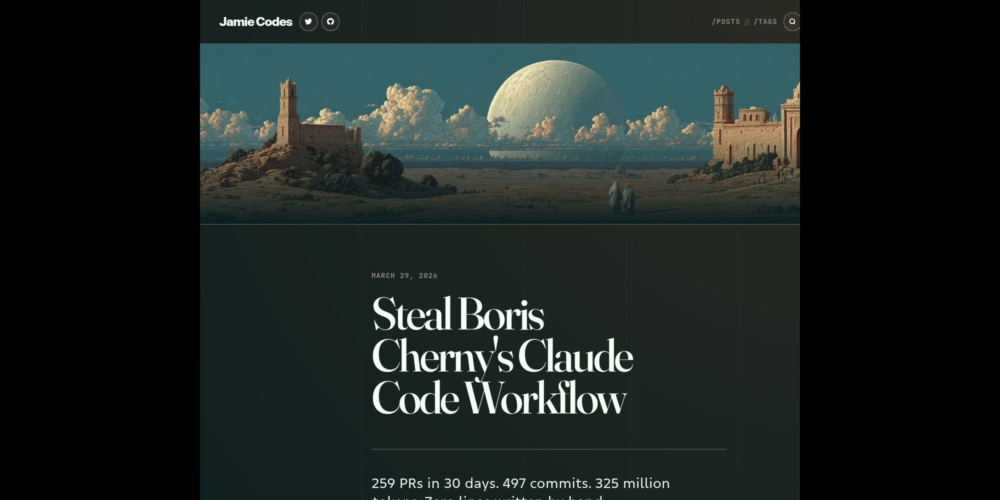

# Ampersand

An editorial magazine-style theme for [Zola](https://www.getzola.org/) with warm parchment colours, serif display headings, and a proportional grid layout.



## Features

- **Light and dark themes** with toggle, auto (system preference), or fixed mode
- **Proportional 5-column grid** that adapts from single column on mobile to full grid on desktop
- **Fluid typography** using `clamp()` for seamless scaling across screen sizes
- **Full-text search** via ElasticLunr.js with a search modal
- **Table of contents** with active section highlighting
- **Code blocks** with syntax highlighting (light/dark), copy button, and language labels
- **4 shortcodes**: `image` (responsive, with AVIF/WebP), `note` (interactive callouts), `mermaid` (diagrams), `character` (dialogue bubbles)
- **Multiple page templates**: homepage, posts, cards (portfolio/projects), talks, taxonomies
- **Reading time** estimates
- **Comments** via Giscus or Utterances
- **Analytics** support for Umami, GoatCounter, and Google Analytics
- **RSS/Atom feeds**
- **Fediverse** creator meta tags
- **MathJax** support for mathematical notation
- **50+ social icons** in SVG

## Installation

Add Ampersand as a Git submodule in your Zola site:

```bash
cd your-zola-site
git submodule add https://github.com/Jabbslad/ampersand.git themes/ampersand
```

Then set the theme in your `config.toml`:

```toml
theme = "ampersand"
```

## Configuration

### Basic setup

```toml
[extra]
theme = "toggle"  # "light", "dark", "auto", or "toggle"

menu = [
    { name = "/posts", url = "/posts", weight = 1 },
    { name = "/tags", url = "/tags", weight = 2 },
]

socials = [
    { name = "github", url = "https://github.com/you", icon = "github" },
    { name = "mastodon", url = "https://mastodon.social/@you", icon = "mastodon" },
]
```

### Feature toggles

```toml
[extra]
toc = false            # Table of contents
fancy_code = false     # Code copy button and language labels
dynamic_note = false   # Clickable note shortcodes
mathjax = false        # MathJax rendering
```

### Analytics

```toml
[extra.analytics]
enabled = true

[extra.analytics.umami]
website_id = "your-id"
host_url = "https://api-gateway.umami.dev/"

[extra.analytics.goatcounter]
user = "your-user"
host = "goatcounter.com"

[extra.analytics.google]
tracking_id = "G-XXXXXXX"
```

### Page options

Set these in a page's TOML frontmatter under `[extra]`:

| Option           | Description                              |
| ---------------- | ---------------------------------------- |
| `hero_image`     | Hero/banner image path or URL            |
| `hero_image_alt` | Alt text for the hero image              |
| `tldr`           | Short summary displayed prominently      |
| `read_time`      | Show estimated reading time              |
| `comment`        | Enable Giscus/Utterances comments        |

## Templates

| Template        | Use case                                          |
| --------------- | ------------------------------------------------- |
| `homepage.html` | Featured post showcase with archive listing        |
| `page.html`     | Standard article/post pages                        |
| `section.html`  | Section listing with pagination                    |
| `cards.html`    | Card grid for portfolios or projects               |
| `talks.html`    | Talk/presentation grid with video thumbnails       |

Set a section's template in its `_index.md` frontmatter:

```toml
template = "cards.html"

[extra]
cards_columns = 2
card_media_height = 200
```

## Shortcodes

### Image

Responsive images with automatic resizing and format conversion:

```
{{/* image(src="photo.jpg", alt="Description") */}}
```

### Note

Interactive callout boxes:

```
{{/* note(header="Note", clickable=true, hidden=true) */}}
Content here.
{{/* end */}}
```

### Mermaid

Diagrams and flowcharts:

```
{{/* mermaid() */}}
graph LR
    A --> B
{{/* end */}}
```

### Character

Dialogue bubbles with avatars:

```
{{/* character(name="Alice", type="info") */}}
Hello there!
{{/* end */}}
```

## Typography

Ampersand uses a carefully chosen variable font stack:

- **Fraunces** (serif) for display headings
- **Inter** for body text
- **JetBrains Mono** for code

All fonts are self-hosted in WOFF2 format.

## Licence

MIT
